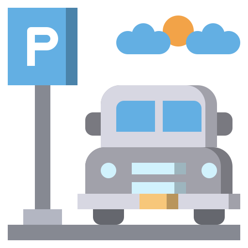

<br/>
StopCar
==================================
[](https://forthebadge.com)
[](https://forthebadge.com)
[](https://android-arsenal.com/api?level=16)
[](https://www.codacy.com/manual/BasetEsmaeili/StopCar?utm_source=github.com&amp;utm_medium=referral&amp;utm_content=BasetEsmaeili/StopCar&amp;utm_campaign=Badge_Grade)
<br/>
[]
# Introduction
This is a repository of android open source application about parked car finder.<br/>
with StopCar you can save your car information such as name, color, date of manufacture and car number plate.<br/>StopCar location finder api will find your location and save it in database.<br/>in history you can see parked car on map and with directions access the routes for achieve your car.<br/>
In order to be successful using these applications, you should have the following experience:
Experience with Android Studio, Java, RecyclerView, SQLite, Google Play Services, Retrofit  Android development.

# Screenshots


# Licence
Copyright 2019 Baset Esmaeili

Licensed under the Apache License, Version 2.0 (the "License"); you may not use this file except in compliance with the License. You may obtain a copy of the License at
```text
http://www.apache.org/licenses/LICENSE-2.0
```
Unless required by applicable law or agreed to in writing, software distributed under the License is distributed on an "AS IS" BASIS, WITHOUT WARRANTIES OR CONDITIONS OF ANY KIND, either express or implied. See the License for the specific language governing permissions and limitations under the License.

# Author

**Baset Esmaeili**

Email: baset.esmaili0@gmail.com

Telegram: https://telegram.me/ikurdish
